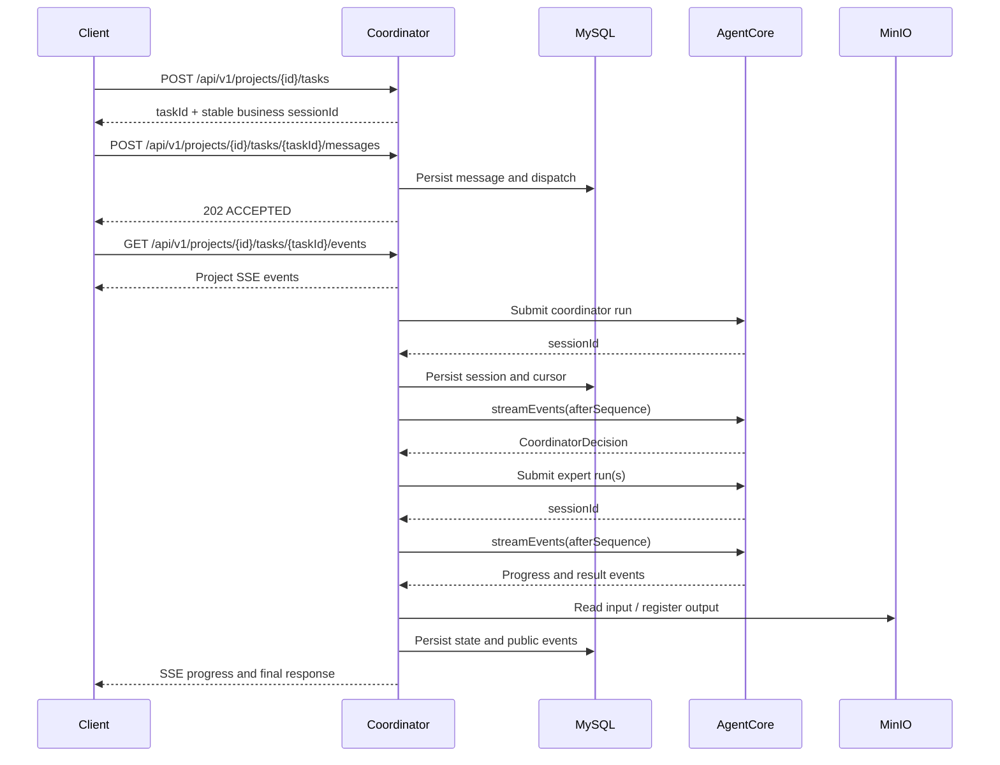

# TeamCoordinator API Documentation

Version: MVP / API v1  
Default localbase URL: `http://localhost:18082`  
Content type unless otherwise stated: `application/json`

## 1. Architecture and API Groups



API groups:

| Group | Prefix | Purpose |
|---|---|---|
| Business API | `/api/v1` | Projects, messages, events, tasks, human input and artifacts |
| Health API | `/health`, `/ready`, `/actuator` | Runtime probes |
| Local mock API | `/mock` | Local AgentCore, expert registry and file-store simulation |
| Remote AgentCore contract | Configurable | Outbound protocol used by Coordinator |

## 2. Common Conventions

### 2.1 Domain Identity

```text
Project
  -> Task (one conversation)
       -> one stable business sessionId
       -> many messages
       -> many Coordinator/expert runs
       -> one isolated event stream
```

The Task's business `sessionId` is generated by Coordinator when a new
conversation is created and remains unchanged for that conversation. It is
Coordinator-owned context and is distinct from the AgentCore session ID.

AgentCore also returns a run `sessionId` for each individual Coordinator or
expert run. Run session IDs are not shared and are only used to address the
corresponding AgentCore run.

### 2.2 Identity Headers

All tenant-scoped `/api/v1/**` endpoints require:

| Header | Required | Description |
|---|---:|---|
| `X-Tenant-Id` | Yes | Tenant boundary |
| `X-User-Id` | Yes | Current user identity |
| `Content-Type` | For JSON body | `application/json` |

Missing identity headers return `401 IDENTITY_REQUIRED`.

**Tenant gate (fail-closed):** the tenant named by `X-Tenant-Id` must exist
and be `ACTIVE`, and the user named by `X-User-Id` must be a member of it
(`digital_team_tenant_user`). Otherwise the request fails before reaching
business logic:

| Condition | HTTP | Code |
|---|---|---|
| Unknown tenant | 404 | `TENANT_NOT_FOUND` |
| Tenant disabled | 403 | `TENANT_DISABLED` |
| User not a tenant member | 403 | `TENANT_ACCESS_FORBIDDEN` |

Platform administrators (env `PLATFORM_ADMIN_USERS`, comma-separated, ∪ the
`digital_team_platform_admin` table — inserting a `user_id` row grants
admin, no API) bypass the membership check — they may access any ACTIVE
tenant — but still cannot access a disabled or unknown tenant. Exceptions
that do not carry the tenant gate:
`/health`, `/ready`, `/mock/**`, `/api/v1/agent-tools/**` (tool-token auth),
`/api/v1/skills`, `/api/v1/experts`, and the tenant endpoints themselves
(`/api/v1/tenants*`, `/api/v1/admin/tenants*` — they require only
`X-User-Id`).

Example:

```http
X-Tenant-Id: tenant-001
X-User-Id: user-001
Content-Type: application/json
```

### 2.3 Date and Naming Formats

- Timestamps are ISO-8601 strings, for example `2026-08-03T18:27:21.576+08:00`.
- Public request fields explicitly shown with underscores use `snake_case`.
- Most response models use Java/Jackson `camelCase`.
- IDs are opaque strings. Clients must not derive meaning from their prefixes.

### 2.4 Error Response

```json
{
  "code": "PROJECT_NOT_FOUND",
  "message": "Project was not found.",
  "time": "2026-08-03T10:00:00Z"
}
```

Common HTTP statuses:

| Status | Meaning |
|---:|---|
| `400` | Validation failure or invalid operation |
| `401` | Identity headers missing |
| `403` | User lacks the required project role |
| `404` | Resource not found, or hidden by tenant/project boundary |
| `409` | Resource state conflict or idempotency conflict |
| `503` | MVP disabled or emergency stop enabled |

### 2.5 Roles

| Role | Typical permissions |
|---|---|
| `OWNER` | Project administration, members, experts, task initiation |
| `MEMBER` | Project access and collaboration |
| `VIEWER` | Read access |

## 3. Project API

### 3.1 Create Project

`POST /api/v1/projects`

Request:

```json
{
  "name": "Risk Review",
  "description": "Analyze service release risks"
}
```

Constraints:

- `name`: required, maximum 128 characters.
- `description`: optional, maximum 1024 characters.

Response: `201 Created`

```json
{
  "id": "project-...",
  "name": "Risk Review",
  "description": "Analyze service release risks",
  "status": "ACTIVE",
  "createdAt": "2026-08-03T10:00:00Z",
  "updatedAt": "2026-08-03T10:00:00Z",
  "members": [
    {
      "userId": "user-001",
      "role": "OWNER"
    }
  ],
  "experts": []
}
```

### 3.2 Get Project

`GET /api/v1/projects/{projectId}`

Response: `200 OK`, body is `ProjectView`.

### 3.3 Update Project

`PATCH /api/v1/projects/{projectId}`

All fields are optional:

```json
{
  "name": "Updated name",
  "description": "Updated description",
  "status": "ARCHIVED"
}
```

`status` values: `ACTIVE`, `ARCHIVED`.

Response: `200 OK`, body is the updated `ProjectView`.

### 3.4 Add or Update Member

`POST /api/v1/projects/{projectId}/members`

```json
{
  "userId": "user-002",
  "role": "MEMBER"
}
```

Response: `200 OK`, body is the updated `ProjectView`.

### 3.5 Remove Member

`DELETE /api/v1/projects/{projectId}/members/{userId}`

Response: `204 No Content`.

### 3.6 Add or Update Expert

`POST /api/v1/projects/{projectId}/experts`

```json
{
  "expertId": "analysis-expert",
  "enabled": true
}
```

Response: `200 OK`, body is the updated `ProjectView`.

### 3.7 Remove Expert

`DELETE /api/v1/projects/{projectId}/experts/{expertId}`

Response: `204 No Content`.

## 4. Conversation Task, Message and Event API

### 4.1 Create Conversation Task

`POST /api/v1/projects/{projectId}/tasks`

Every new conversation must call this endpoint once.

```json
{
  "title": "Payment API risk review"
}
```

Response: `201 Created`

```json
{
  "taskId": "task-...",
  "projectId": "project-...",
  "sessionId": "session-...",
  "title": "Payment API risk review",
  "status": "ACTIVE",
  "createdAt": "2026-08-03T10:00:00Z"
}
```

### 4.2 Get Conversation Task

`GET /api/v1/projects/{projectId}/tasks/{taskId}`

Response: `200 OK`, body is `ConversationTaskView`.

### 4.3 Submit Message

`POST /api/v1/projects/{projectId}/tasks/{taskId}/messages`

This is the primary asynchronous entry point. The request is persisted before
the response is returned.

```json
{
  "client_message_id": "client-msg-001",
  "text": "分析接口风险并撰写报告",
  "attachment_refs": ["artifact-..."]
}
```

Constraints:

| Field | Required | Constraint |
|---|---:|---|
| `client_message_id` | Yes | Maximum 128 characters |
| `text` | Yes | Maximum 10,000 characters |
| `attachment_refs` | No | Maximum 10 entries |

Response: `202 Accepted`

```json
{
  "messageId": "message-...",
  "taskId": "task-...",
  "sessionId": "session-...",
  "status": "ACCEPTED"
}
```

`client_message_id` is generated by the caller and uniquely identifies one
message inside a conversation task. Retrying with the same value returns the
existing accepted message, so a second message-level idempotency key is not
required.

### Database Identity Convention

Database tables use `id BIGINT AUTO_INCREMENT` as an internal, meaningless
primary key. Domain entities also have a stable business identity:

- Aggregate and event tables use a unique `business_id` column.
- Association tables use their natural business column combination as a unique
  constraint.
- API fields such as `id`, `taskId`, `messageId`, and `artifactId` expose the
  business identity and never expose the numeric database primary key.
- Cross-table domain references point to business IDs. The numeric key remains
  an implementation detail for storage, indexing, and deterministic ordering.

### 4.4 Subscribe to Task Events

`GET /api/v1/projects/{projectId}/tasks/{taskId}/events`

Request headers:

```http
Accept: text/event-stream
Last-Event-ID: 42
```

`Last-Event-ID` is optional. When supplied, events with a greater sequence are
replayed from MySQL before live delivery. Invalid values are treated as `0`.

Response content type: `text/event-stream`

```text
id: 43
event: TASK_STARTED
data: {"id":"event-...","projectId":"project-...","taskId":"task-...","messageId":"message-...","sequence":43,"type":"TASK_STARTED","payload":{"messageId":"message-...","text":"Expert analysis-expert accepted the task."},"createdAt":"2026-08-03T10:00:00Z"}

```

Public event types:

| Type | Meaning |
|---|---|
| `COORDINATOR_ANALYZING` | Coordinator accepted the message for analysis |
| `PLAN_CREATED` | A plan was created |
| `PLAN_REVISED` | A replacement plan version was created |
| `TASK_STARTED` | Expert accepted a task |
| `TASK_PROGRESS_UPDATED` | Expert progress changed |
| `TASK_WAITING_HUMAN` | Human input is required |
| `TASK_SUCCEEDED` | Expert task completed |
| `TASK_FAILED` | Expert task failed |
| `ARTIFACT_CREATED` | Output artifact was registered |
| `FINAL_RESPONSE` | Final user-facing response |

Standard event payload:

```json
{
  "messageId": "message-...",
  "text": "Human-readable event text"
}
```

Human-input event payload:

```json
{
  "messageId": "message-...",
  "humanRequestId": "human-...",
  "requestType": "CLARIFICATION",
  "text": "Please provide the missing information."
}
```

The internal type `MESSAGE_ACCEPTED_INTERNAL` is not delivered through the
public SSE stream.

## 5. Intent Analysis API

### 5.1 Analyze Intent Directly

`POST /api/v1/projects/{projectId}/intent-analysis`

This endpoint is intended for diagnostics and direct analysis. The normal
product workflow should use the asynchronous message endpoint.

```json
{
  "text": "分析附件并生成报告",
  "attachment_refs": ["artifact-..."]
}
```

Response variants:

Direct answer:

```json
{
  "decision_type": "ANSWER",
  "answer": "Answer text",
  "analysis_id": "analysis-..."
}
```

Ask human:

```json
{
  "decision_type": "ASK_HUMAN",
  "question": "请补充要处理的具体对象、目标或期望输出。",
  "analysis_id": "analysis-...",
  "human_request_id": "human-..."
}
```

Create plan:

```json
{
  "decision_type": "CREATE_PLAN",
  "task_intent": {
    "intent": "ANALYZE",
    "objective": "分析附件并生成报告",
    "expected_outputs": ["分析报告"],
    "constraints": ["使用项目当前可用专家和已有上下文"],
    "required_capabilities": ["analysis", "writing"],
    "input_refs": ["artifact-..."],
    "missing_information": [],
    "risk_level": "MEDIUM",
    "execution_mode": "MULTI_EXPERT"
  },
  "analysis_id": "analysis-..."
}
```

Enums:

- `decision_type`: `ANSWER`, `ASK_HUMAN`, `CREATE_PLAN`
- `risk_level`: `LOW`, `MEDIUM`, `HIGH`
- `execution_mode`: `SINGLE_EXPERT`, `MULTI_EXPERT`

## 6. Human-in-the-loop API

### 6.1 Respond to Human Request

`POST /api/v1/projects/{projectId}/human-requests/{requestId}/responses`

```json
{
  "decision": "ANSWER",
  "response": {
    "text": "Use the payment API as the analysis target."
  },
  "idempotencyKey": "human-response-001"
}
```

`decision` values:

- `ANSWER`: provide clarification.
- `APPROVE`: approve a proposed action.
- `REJECT`: reject a proposed action.

Response: `200 OK`

```json
{
  "id": "human-...",
  "projectId": "project-...",
  "taskId": "task-...",
  "requestType": "CLARIFICATION",
  "question": "Which API should be analyzed?",
  "status": "RESOLVED",
  "decision": "ANSWER",
  "response": {
    "text": "Use the payment API as the analysis target."
  },
  "expiresAt": "2026-08-04T10:00:00Z"
}
```

`requestType` values: `CLARIFICATION`, `APPROVAL`.

## 7. Task API

### 7.1 Cancel Task

`DELETE /api/v1/projects/{projectId}/expert-tasks/{expertTaskId}`

The Coordinator forwards cancellation to AgentCore and persists the returned
terminal event.

Response: `200 OK`

```json
{
  "id": "task-...",
  "planId": "plan-...",
  "taskKey": "analyze-risk",
  "requestId": "message-...:analyze-risk",
  "expertId": "analysis-expert",
  "sessionId": "run-...",
  "status": "CANCELLED",
  "objective": "Analyze API risks",
  "expectedOutput": "Risk analysis",
  "acceptanceCriteria": "Result is non-empty",
  "resultJson": null,
  "correctionOf": null,
  "correctionCount": 0,
  "dependencies": [],
  "requiredCapabilities": ["analysis"],
  "lastSequence": 4
}
```

## 8. Artifact API

### 8.1 Reserve Upload

`POST /api/v1/projects/{projectId}/artifacts/uploads`

```json
{
  "fileName": "requirements.txt",
  "mediaType": "text/plain",
  "taskId": null
}
```

Response: `200 OK`

```json
{
  "artifactId": "artifact-...",
  "version": 1,
  "fileName": "requirements.txt",
  "mediaType": "text/plain",
  "size": null,
  "sha256": null,
  "status": "UPLOADING",
  "uploadUrl": "http://...",
  "downloadUrl": "http://..."
}
```

Upload the bytes to `uploadUrl`, then call the completion endpoint.

### 8.2 Complete Upload

`POST /api/v1/projects/{projectId}/artifacts/{artifactId}/complete`

Response: `200 OK`, body is `ArtifactView` with status `AVAILABLE`, size and
SHA-256 populated.

Calling completion before the object exists returns `409 Conflict`.

### 8.3 Get Artifact

`GET /api/v1/projects/{projectId}/artifacts/{artifactId}`

Response: `200 OK`, body is `ArtifactView`.

### 8.4 AgentCore Tool: Upload Artifact

Tool name: `upload_artifact`

`POST /api/v1/agent-tools/projects/{projectId}/tasks/{taskId}/artifacts`

AgentCore must register this endpoint as a file-capable HTTP tool. The Agent
only sees the tool name and its `file` argument. AgentCore sends the generated
file as `multipart/form-data` and injects these headers:

Expert task submission declares the tool and supplies routing metadata:

```json
{
  "requiredTools": ["upload_artifact"],
  "toolContext": {
    "projectId": "project-...",
    "taskId": "task-..."
  }
}
```

`toolContext` is AgentCore runtime metadata used to resolve the registered URL
template. It must not be exposed as model-controlled tool arguments.

| Header | Meaning |
|---|---|
| `X-AgentCore-Tool-Token` | Coordinator-configured tool credential |
| `X-Session-Id` | Stable business session for the conversation Task |
| `X-Agent-Run-Id` | AgentCore run `sessionId` returned by task submission |
| `X-Agent-Id` | Expert Agent identifier assigned to the run |

Multipart field:

| Field | Type | Required | Meaning |
|---|---|---|---|
| `file` | binary file | yes | File generated by the Agent |

Response: `201 Created`

```json
{
  "artifactId": "artifact-...",
  "version": 1,
  "fileName": "analysis.md",
  "mediaType": "text/markdown",
  "size": 1024,
  "sha256": "...",
  "status": "AVAILABLE",
  "downloadUrl": "https://..."
}
```

Coordinator validates that the Agent run belongs to the supplied Project,
conversation Task, business session and Agent. It then writes the file to
object storage and records the database Artifact in one tool call. AgentCore
and the Agent never receive MinIO credentials.

Configuration:

- `AGENTCORE_ARTIFACT_TOOL_TOKEN`: shared credential injected by AgentCore.
- Maximum file size: 10 MiB.

The expert includes returned Artifact IDs in its terminal event:

```json
{
  "type": "RUN_SUCCEEDED",
  "payload": {
    "resultText": "Completed analysis...",
    "artifactIds": ["artifact-..."]
  }
}
```

`artifactFileIds` remains supported only for the in-process legacy Mock.

## 9. Workspace Snapshot API

### 9.1 Get Workspace Snapshot

`GET /api/v1/projects/{projectId}/tasks/{taskId}/workspace`

Response:

```json
{
  "project": {},
  "task": {},
  "messages": [],
  "events": [],
  "plans": [],
  "tasks": [],
  "humanRequests": [],
  "artifacts": []
}
```

This is a read-oriented aggregate endpoint. It returns public events only.
Several nested fields are raw database JSON strings and should be treated as
diagnostic data rather than a stable domain schema.

## 10. Prompt Management API

Prompt templates are stored in MySQL and are not loaded from project resource
files.

| Prompt key | Scene | Purpose |
|---|---|---|
| `coordinator.execution` | `COORDINATOR_EXECUTION` | Intent routing, delegation context and output protocol |
| `expert.execution` | `EXPERT_EXECUTION` | Subtask background, acceptance criteria and communication protocol |
| `expert.resume` | `EXPERT_RESUME` | Resume an expert task after human input |

Templates use `{{context_json}}` for runtime context. Dynamic content is
serialized as JSON and treated as untrusted task data.

### 10.1 List Prompt Versions

`GET /api/v1/admin/prompts?promptKey=expert.execution`

Requires a user listed in `PROMPT_ADMIN_USERS`.

### 10.2 Create Draft Version

`POST /api/v1/admin/prompts`

```json
{
  "promptKey": "expert.execution",
  "agentScope": "EXPERT_COMMON",
  "scene": "EXPERT_EXECUTION",
  "templateContent": "Instructions...\n{{context_json}}",
  "variablesSchema": "{\"required\":[\"context_json\"]}"
}
```

The server assigns the next immutable version and creates it as `DRAFT`.

### 10.3 Publish Version

`POST /api/v1/admin/prompts/{promptId}/publish`

The selected version becomes `PUBLISHED`; the prior version becomes
`RETIRED`. Each render is recorded in `digital_team_prompt_execution` with its template,
version, Agent, scene, variables snapshot and rendered Prompt.

## 11. Health API

### 11.1 Liveness

`GET /health`

```json
{
  "status": "UP",
  "service": "TeamCoordinator",
  "time": "2026-08-03T10:00:00Z"
}
```

### 11.2 Readiness

`GET /ready`

```json
{
  "status": "READY",
  "service": "TeamCoordinator",
  "time": "2026-08-03T10:00:00Z"
}
```

Spring Boot probes are also available below `/actuator`, including
`/actuator/health`.

## 12. AgentCore Integration Contract

The following is the outbound contract expected by Coordinator. Paths are
configurable through environment variables.

| Operation | Default method and path | Configuration |
|---|---|---|
| Submit | `POST /runs` | `AGENTCORE_SUBMIT_PATH` |
| Status | `GET /runs/{sessionId}` | `AGENTCORE_STATUS_PATH` |
| Stream | `GET /runs/{sessionId}/streamEvents` | `AGENTCORE_STREAM_PATH` |
| Stop or answer | `POST /runs` | `AGENTCORE_SUBMIT_PATH` |

Base URL: `AGENTCORE_BASE_URL`.

Authentication:

```http
Authorization: <AGENTCORE_AUTH_VALUE>
```

The header name can be changed with `AGENTCORE_AUTH_HEADER`.

### 12.1 Submit Agent Run

```json
{
  "type": "userInput",
  "sessionId": "",
  "systemPrompt": "Database-managed coordinator or expert system prompt",
  "data": {
    "skillNames": ["cmb-ui-design"],
    "skillOrigin": "skillMarket",
    "contents": [{"type": "text", "value": "Analyze API risks"}],
    "context": [{"type": "text", "value": "{\"projectName\":\"Risk Review\"}"}],
    "attachments": [{
      "fileName": "requirements.pdf",
      "fileDownloadUrl": "https://minio.example/presigned-url"
    }]
  }
}
```

`sessionId` is empty for a new AgentCore conversation. Prompts are loaded from
the Coordinator database. Attachments use directly downloadable MinIO
pre-signed URLs; AgentCore does not receive MinIO credentials.

```json
{
  "returnCode": "SUC0000",
  "data": {
    "sessionId": "run-...",
    "conversationId": "conversation-...",
    "queuePosition": 0
  }
}
```

Errors use `{"returnCode":"K8S6004","message":"入参不合法"}`. Coordinator-side
idempotency remains in MySQL and is not sent in this AgentCore payload.

### 12.2 Coordinator Agent Submission

Coordinator and expert calls share the wire format. Their database prompt
templates and hidden context construction differ. Coordinator context contains
the overall request and conversation; expert context contains the delegated
subtask, background, expected output, acceptance criteria and protocol.

### 12.3 Query Status

`GET /runs/{sessionId}`

Response is the latest `AgentRunEvent`, or `404` when the run is unknown.

### 12.4 Stream Run Events

`GET /runs/{sessionId}/streamEvents?afterSequence={sequence}`

Request headers:

```http
Content-Type: application/json
Accept: text/event-stream
Authorization: ...
```

The request has no JSON body. Despite the JSON request content type, the
response must use:

```http
Content-Type: text/event-stream
```

Each `data:` chunk is JSON and has a globally unique top-level `eventId` beside
`type`. Example:

```text
data:{"type":"liveStatus","content":"模型响应中","timestamp":1769482300130,"eventId":"evt-1"}
data:{"type":"chat","content":"分析完成","timestamp":1769482300131,"eventId":"evt-2"}
data:{"type":"end","attachments":[],"timestamp":1769482300132,"eventId":"evt-3"}
```

Supported raw types include `taskInQueue`, `liveStatus`, `planUpdate`,
`newPlanStep`, `confirm`, `chat`, `streamStart`, `textDelta`, `streamEnd`,
thinking events, tool events, subagent events, file events, `error` and `end`.
All original fields are retained in the normalized event payload. Coordinator
deduplicates by `eventId`; its numeric sequence is a local database ordering
cursor, not an AgentCore identity.

### 12.5 Stop and Human Answer

```json
{"type":"stopSession","sessionId":"run-..."}
```

```json
{
  "type":"userAnswerQuestion",
  "sessionId":"run-...",
  "data":{
    "questionId":"agentcore-question-id",
    "answers":{"写作主题":"武侠","写作风格":"简洁直白"}
  }
}
```

### 12.6 Coordinator Success Payload

The Coordinator agent must return a schema-valid decision:

```json
{
  "sessionId": "run-...",
  "sequence": 3,
  "type": "RUN_SUCCEEDED",
  "status": "SUCCEEDED",
  "payload": {
    "decision": {
      "decision_type": "CREATE_PLAN",
      "task_intent": {
        "intent": "ANALYZE",
        "objective": "Analyze API risks",
        "expected_outputs": ["Risk report"],
        "constraints": [],
        "required_capabilities": ["analysis"],
        "input_refs": [],
        "missing_information": [],
        "risk_level": "MEDIUM",
        "execution_mode": "SINGLE_EXPERT"
      }
    }
  }
}
```

`payload.decision` may also be a JSON string. A result may alternatively be
placed in `payload.resultText`, but it must contain the complete decision JSON.

### 12.6 Expert Success Payload

```json
{
  "sessionId": "run-...",
  "sequence": 3,
  "type": "RUN_SUCCEEDED",
  "status": "SUCCEEDED",
  "payload": {
    "expertId": "analysis-expert",
    "resultText": "Completed analysis...",
    "artifactIds": ["artifact-..."]
  }
}
```

`payload.resultText` is required and must be non-empty. `artifactIds` is
optional. Every ID must have been created by the `upload_artifact` tool for
the same Agent run. `artifactFileIds` is a legacy in-process Mock field.

### 12.7 Waiting for Human Input

```json
{
  "sessionId": "run-...",
  "sequence": 3,
  "type": "RUN_WAITING_HUMAN",
  "status": "WAITING_HUMAN",
  "message": "More information is required.",
  "payload": {
    "question": "Which environment should be analyzed?",
    "requestType": "CLARIFICATION"
  }
}
```

`payload.question` is required by the Coordinator workflow.

### 12.8 Cancel Run

`POST /runs/{sessionId}/cancel`

Response: terminal `AgentRunEvent` with type `RUN_CANCELLED`; `404` if the
session does not exist.

## 13. Local Mock API

These endpoints are development-only and should not be exposed in production.

### 13.1 List Mock Experts

`GET /mock/experts`

```json
[
  {
    "expertId": "analysis-expert",
    "displayName": "Analysis Expert",
    "enabled": true,
    "available": true,
    "concurrencyLimit": 2,
    "capabilities": ["analysis"]
  }
]
```

### 13.2 Submit Mock Run

`POST /mock/agentcore/runs`

Uses the AgentCore submit request and returns `202 Accepted`.

### 13.3 Get Mock Run

`GET /mock/agentcore/runs/{sessionId}`

### 13.4 Stream Mock Run

`GET /mock/agentcore/runs/{sessionId}/streamEvents?afterSequence=0`

Response: `text/event-stream`.

Stop and HITL answers are posted to `/mock/agentcore/runs` with the same
`stopSession` and `userAnswerQuestion` request bodies as real AgentCore.

### 13.6 Reserve Mock File

`POST /mock/files/presign`

```json
{
  "fileName": "input.txt",
  "contentType": "text/plain"
}
```

Response:

```json
{
  "fileId": "mock-file-...",
  "fileName": "input.txt",
  "contentType": "text/plain",
  "size": 0,
  "checksum": null,
  "uploadUrl": "/mock/files/mock-file-.../content",
  "downloadUrl": "/mock/files/mock-file-.../content"
}
```

### 13.7 Upload Mock File

`PUT /mock/files/{fileId}/content`

Request body: raw binary bytes.

### 13.8 Get Mock File Metadata

`GET /mock/files/{fileId}`

### 13.9 Download Mock File

`GET /mock/files/{fileId}/content`

Response content type: `application/octet-stream`.

### 13.10 Delete Mock File

`DELETE /mock/files/{fileId}`

Response: `204 No Content`, or `404` if not found.

## 14. Runtime Configuration

| Environment variable | Default | Purpose |
|---|---|---|
| `AGENTCORE_MOCK_ENABLED` | `true` | Select local mock or remote HTTP adapter |
| `AGENTCORE_BASE_URL` | Empty | Remote AgentCore base URL |
| `COORDINATOR_AGENT_ID` | `coordinator` | Coordinator agent identifier |
| `AGENTCORE_SESSION_HEADER` | `X-Session-Id` | Business Task session header |
| `AGENTCORE_AUTH_HEADER` | `Authorization` | Authentication header name |
| `AGENTCORE_AUTH_VALUE` | Empty | Authentication header value |
| `AGENTCORE_SUBMIT_PATH` | `/runs` | Submit endpoint |
| `AGENTCORE_STATUS_PATH` | `/runs/{sessionId}` | Status endpoint |
| `AGENTCORE_STREAM_PATH` | `/runs/{sessionId}/streamEvents` | SSE endpoint |
| `AGENTCORE_CANCEL_PATH` | `/runs/{sessionId}/cancel` | Cancel endpoint |
| `MYSQL_URL` | Local `xservice` database | Coordinator state database |
| `MYSQL_USERNAME` | `root` | Database user |
| `MYSQL_PASSWORD` | Empty | Database password |
| `MINIO_ENDPOINT` | `http://127.0.0.1:9000` | Object storage endpoint |
| `MINIO_ACCESS_KEY` | `minioadmin` | Object storage access key |
| `MINIO_SECRET_KEY` | `minioadmin` | Object storage secret |
| `MINIO_BUCKET` | `digital-team` | Object storage bucket |
| `DIGITAL_TEAM_MVP_ENABLED` | `true` | MVP feature flag |
| `DIGITAL_TEAM_EMERGENCY_STOP` | `false` | Emergency kill switch |

## 15. Tenant API

Tenant management. These endpoints require only `X-User-Id` (the user may
hold a stale tenant in local storage). User ids come from the external login
system — this service stores no user entity, only tenant→user assignments.

### 15.1 List My Tenants (tenant switcher source)

```http
GET /api/v1/tenants
X-User-Id: user-001
```

Returns the tenants the user belongs to, each with `role`
(`TENANT_ADMIN` | `MEMBER`) and `status` (`ACTIVE` | `DISABLED`).

### 15.2 Tenant-admin self-service (requires TENANT_ADMIN of the tenant)

| Method & path | Body / params | Description |
|---|---|---|
| `PATCH /api/v1/tenants/{tenantId}` | `{name?, description?}` | Update own tenant info (owner/status not changeable) |
| `GET /api/v1/tenants/{tenantId}/members` | — | List members |
| `POST /api/v1/tenants/{tenantId}/members` | `{userId, role}` | Assign member (`TENANT_ADMIN`/`MEMBER`) |
| `DELETE /api/v1/tenants/{tenantId}/members/{userId}` | — | Remove member (204) |

### 15.3 Platform admin endpoints (`PLATFORM_ADMIN_USERS`)

| Method & path | Body / params | Description |
|---|---|---|
| `GET /api/v1/admin/tenants` | — | List all tenants |
| `POST /api/v1/admin/tenants` | `{name, description?, ownerUserId}` | Create tenant (201); creator becomes `TENANT_ADMIN` |
| `PATCH /api/v1/admin/tenants/{tenantId}` | `{name?, description?, ownerUserId?}` | Full update |
| `POST /api/v1/admin/tenants/{tenantId}/disable` | — | Disable tenant (204, idempotent) |
| `DELETE /api/v1/admin/tenants/{tenantId}` | — | Hard delete (204) — only when the tenant has no projects |
| `POST /api/v1/admin/tenants/{tenantId}/members` | `{userId, role}` | Assign member in any tenant |
| `DELETE /api/v1/admin/tenants/{tenantId}/members/{userId}` | — | Remove member (204) |

Error codes: `PLATFORM_ADMIN_REQUIRED` (403), `TENANT_MANAGE_FORBIDDEN` (403),
`TENANT_NAME_EXISTS` (409), `TENANT_HAS_PROJECTS` (409),
`TENANT_OWNER_REMOVAL_FORBIDDEN` (409),
`TENANT_LAST_ADMIN_REMOVAL_FORBIDDEN` (409), `TENANT_ROLE_INVALID` (400),
`TENANT_NOT_FOUND` (404).
